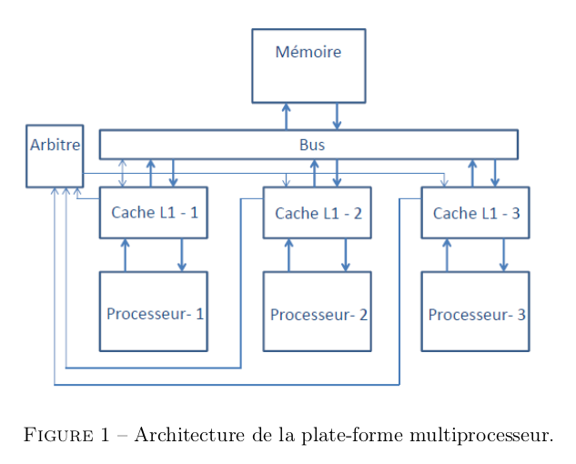
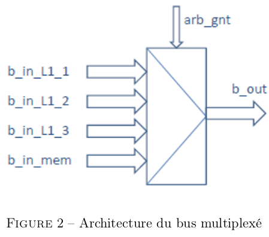
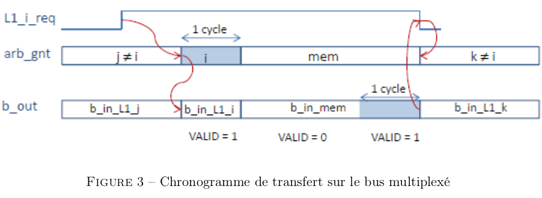
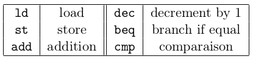

# Projet - Modélisation et Vérification de systèmes concurrents

# Architecture multiprocesseur à mémoire partagée

* On est dans un **système multiprocesseur à mémoire partagée**.
* Le système est muni d’une hiérarchie mémoire à **deux niveaux** : 
  * **Mémoire centrale**, partagée : stocke les instructions, données, pile des programmes en cours d’exécution et du système d’exploitation.
  * **Caches privés** associés à chaque processeur, comprennant deux parties distinctes :
    * *Cache d’instructions*
    * *Cache de données*
* Les **processeurs+caches** et **la mémoire** sont **connectés autour d’un bus**, dont l’accès est régi par un **arbitre de bus**.  

    

*Remarque : On ne modélisera que les transferts induits par les mouvements de données (et non pas les flux instructions).*

## 1. Composants constructifs
### 1.1 Processeur

Le processeur exécute des instructions du programme en cours. Il émet des requêtes de **lecture** et **écriture** de données vers son **cache privé L1**.
* **CPU_RD(ad)** : demande le mot d’adresse *ad* qui lui sera transmis (au mieux au même cycle) par le cache L1. Tant que la donnée n’est pas transmise par le cache L1, le processeur est gelé : il n’effectue aucune action.
* **CPU_WR(ad,val)** : requête d’écriture de la valeur *val* à l’adresse *ad*; la requête est transmise au cache L1. Tant que la requête n’a pas été validée par le cache L1, le processeur est gelé. (on ignore les mécanismes d’écriture non bloquante)

### 1.2 Mémoire

La mémoire est composée de *n* mots de *m* bits, adressable par mot.
* Dans un premier temps, on suppose que n = 2 et m = 1. 
* De plus, on considérera que les mots d’adresses 0 et 1 correspondent à des données cachables. 
* La mémoire est interfacée sur le bus et agit sur sollicitation de requêtes d’un des caches.

  * **READ(ad)** : demande de lecture du mot d’adresse *ad*, transitant sur le bus, issue d’un cache L1. La mémoire produit le contenu du mot d’adresse *ad* sur le bus (au cycle suivant pour simplifier).
  * **WRITE(ad,val)** : demande d’écriture de la valeur *val* à l’adresse *ad*, transitant sur le bus, issue d’un cache L1. La mémoire modifie le contenu du mot d’adresse *ad* en y affectant la valeur *val* et produit un signal d’acquiescement sur le bus au cycle suivant.
  
### 1.3 Bus

Le bus interconnecte la mémoire et les caches L1 des processeurs. Il est composé de trois
nappes de fils :
* **AD** : adresse du mot à transmettre
* **DT** : valeur du mot transmis (en lecture ou en écriture)
* **CTRL** : sens du tranfert (lecture ou écriture)

*Remarque : le champ **VALID** indique que les données présentes sur le bus sont significatives.*

Le **bus est une ressource partagée** et un point de synchronisation du système :
* Partagé par :
  * Les différents caches L1 qui initient des transferts de et vers la mémoire.
  * La mémoire qui répond aux sollicitations des caches.
* L’architecture du bus considérée est **multiplexée** : le bus est composé de **4 nappes de fils AD/DT/CTRL** (une par cache L1 et mémoire pouvant écrire sur le bus, nommées *b_in*), aiguillées sur une unique nappe de fils AD/DT/CTRL (nommée *b_out*) qui peut-être lue par tous les composants connectés au bus. L’aiguillage est réalisé par un multiplexeur 4 × 1, commandé par le signal généré par l’arbitre de bus (cf. Figure 2).

    

* C’est **un point de synchronisation** : à tout instant, les données transitant sur le bus *b_out* peuvent être lues simultanément par tous les caches L1 et la mémoire. **Tous les composants connectés voient les requêtes transitant sur le bus dans le même ordre** : la séquence de requêtes WRITE(0,0);...; WRITE(0,1) sera interprétée par tous de la même façon (écriture de la valeur 0 à l’adresse 0, puis écriture de la valeur 1 à l’adresse 0), ils peuvent tous réagir au même instant en connaissant les mêmes informations.

### 1.4 Arbitre de bus

**L’arbitre définit**, lorsqu’il y a **plusieurs requêtes simultanées vers la mémoire**, celle qui a la **priorité d’accès sur le bus**. Une requête qui **accède au bus conserve l’exclusivité d’accès jusqu’à ce que cette requête ait été acquittée par la mémoire**. Lorsqu’il **sélectionne la requête i**, l’arbitre positionne le **signal arb_gnt à i pour un cycle**, puis **donne l’accès du bus à la mémoire dès le cycle suivant**, jusqu’à ce que **la mémoire valide la requête i**. Un autre arbitrage peut avoir lieu ensuite.

Le chronogramme de la figure 3 montre l’**incidence de l’arbitrage** sur les données transitant sur le bus.
* Une requête *i* survient (signal *L1_i_req* positionné et maintenu à 1).
* Plus tard, (lorsque la requête *j* en cours sera terminée), la requête *i* sera choisie par l’arbitre (le signal *arb_gnt* a la valeur *i* **pour un cycle**).
* La transaction passant sur le bus *b_out* est celle positionnée par le cache *L1_i*, sur son interface *b_in_L1_i* (les données associées à cette requête doivent être positionnées et valides).
* **Au cycle suivant, l’arbitre donne l’accès à la mémoire**, qui répond sur le bus dès que les données associées à la requête *i* sont disponibles (en positionnant la donnée et le signal VALID) sur son interface *b_in_mem*.
* Le cache *L1_i* ayant reçu la réponse à sa requête, il désactive le signal de requête L1_i_req vers l’arbitre.
* Ce dernier peut alors donner l’accès au bus à une autre requête s’il y en a au moins une ; sinon, il laisse l’accès à la mémoire (qui a désactivé son signal VALID...).
  

    

### 1.5 Cache L1
Le cache L1 stocke le mot préalablement demandé en lecture par le processeur auquel il est associé, jusqu’à ce que ce mot soit mis à jour ou évincé. On suppose que le cache ne peut contenir qu’un mot à la fois. Lorsqu’un mot en remplace un autre, le mot évincé est simplement écrasé.

#### 1.5.1 Interface CPU/L1
* Sur réception d’une requête **CPU_RD(ad)**, le cache détermine s’il dispose du mot d’adresse *ad*. S’il dispose de la donnée valide, il la transmet au CPU dans le même cycle (sur les signaux de réponse prévus entre le processeur et son cache L1). Sinon, il gèle le processeur et demande l’accès au bus à l’arbitre puis transmet une requête de lecture vers la mémoire (**READ(ad)**) et recevra la donnée par le bus (sur *b_out*, lorsque **arb_gnt = mem et VALID=1**). Le cache stocke alors le mot reçu (association adresse/valeur du mot), et transmet la valeur au processeur.
* Sur réception d’une requête **CPU_WR(ad,val)**, le cache détermine s’il dispose du mot d’adresse *ad*. S’il en dispose, il le met à jour, acquitte le processeur et transmet la requête vers la mémoire ; sinon, il transmet la requête vers la mémoire et dégelera le processeur à réception de l’acquittement de la mémoire (**il ne rappatrie pas le mot à modifier**).
  
#### 1.5.2 Interface L1/arbitre/bus
* Lorsque le cache L1 doit transmettre une requête vers la mémoire, il demande l’accès au bus à l’arbitre.
* La demande du cache L1_i active le signal req_L1_i jusqu’à ce que l’arbitre donne l’accès au bus (signal arb_gnt=i).
* Lorsque l’accès est donné, le cache écrit ses données sur le bus dans le **même cycle** (les données ont été préchargées sur l’interface b_in_L1_i, et le signal arb_gnt positionné à i aiguille ce flot vers le bus b_out).
* Lorsque le cache L1 a transmis une requête sur le bus, il attend la réponse provenant du bus (les transactions sur le bus sont insécables) à l’exclusion de toute autre action.
* (Mécanisme de **SNOOP**) Lorsqu’une requête d’écriture circule sur le bus, chaque cache connecté doit déterminer s’il dispose du mot concerné. Dans l’affirmative, il met à jour sa copie locale avec la donnée à écrire, véhiculée sur le bus.

## 2 Travail à réaliser

### 2.1 Etude du protocole et des accès aux données partagées

#### 2.1.1 Cas monoprocesseur

Illustration des **transferts d’informations** induits par l’exécution des programmes **P1a** puis **P1b** sur le processeur 1 (les processeurs 2 et 3 sont inactifs) : 
* Le cache est vidé entre l’exécution des deux programmes.
* Dans ces programmes, les mnémoniques désignent les actions décrites dans la table :

    

* Les symboles **R1**, **R2**, **R3** désignent des registres du processeur, les symboles *0* et *1* désignent les constantes de mêmes valeurs, le symboles **[0]** et **[1]** désignent les **adresses 0 et 1**.

**Effet cache**  
**P1a** :  

&nbsp;&nbsp;&nbsp;&nbsp;&nbsp;&nbsp;&nbsp;&nbsp;&nbsp;&nbsp; **ld** R1, [0] *// charger la valeur se trouvant à l'adresse 0 dans le registre R1*   
&nbsp;&nbsp;&nbsp;&nbsp;&nbsp;&nbsp;&nbsp;&nbsp;&nbsp;&nbsp; **add** R1, R1, 1 *// incrémenter de 1 la valeur se trouvant dans R1*  
&nbsp;&nbsp;&nbsp;&nbsp;&nbsp;&nbsp;&nbsp;&nbsp;&nbsp;&nbsp; **st** R1, [1] *// écrire la valeur se trouvant dans R1 à l'adresse 1*  
&nbsp;&nbsp;&nbsp;&nbsp;&nbsp;&nbsp;&nbsp;&nbsp;&nbsp;&nbsp; **ld** R2, [0] *// charger dans R2 la valeur se trouvant à l'adresse 0*  
&nbsp;&nbsp;&nbsp;&nbsp;&nbsp;&nbsp;&nbsp;&nbsp;&nbsp;&nbsp; **add** R2, R2, 1 *// incrémenter de 1 la valeur se trouvant dans R2*  
&nbsp;&nbsp;&nbsp;&nbsp;&nbsp;&nbsp;&nbsp;&nbsp;&nbsp;&nbsp; **st** R2, [0] *// écrire la valeur se trouvant dans R2 à l'adresse 0*  

**Eviction du cache / écriture write-trough**  
**P1b** :  
&nbsp;&nbsp;&nbsp;&nbsp;&nbsp;&nbsp;&nbsp;&nbsp;&nbsp;&nbsp; **ld** R1, [0] *// charger la valeur se trouvant à l'adresse 0 dans le registre R1*   
&nbsp;&nbsp;&nbsp;&nbsp;&nbsp;&nbsp;&nbsp;&nbsp;&nbsp;&nbsp; **ld** R2, [1] *// charger la valeur se trouvant à l'adresse 1 dans le registre R2*   
&nbsp;&nbsp;&nbsp;&nbsp;&nbsp;&nbsp;&nbsp;&nbsp;&nbsp;&nbsp; **add** R3, R1, R2 *// faire l'addition des valeurs de R1 et R2 puis mettre le résultat dans R3*  
&nbsp;&nbsp;&nbsp;&nbsp;&nbsp;&nbsp;&nbsp;&nbsp;&nbsp;&nbsp; **st** R3, [0] *// écrire la valeur se trouvant dans R3 à l'adresse 0* 

### 2.2 Modélisation des composants

Ddécrire le comportement des différents éléments constitutifs de la plateforme avec l’outil de modélisation et vérification **NuSMV**.  

On privilégiera une description *booléenne*, intégrant quelques constantes entières (minimiser les calculs sur entiers). On utilisera à profit les *tableaux* ou les *types énumérés* pour décrire des *collections de données* (nappes de fils du bus, signaux d’interface des composants).  

**Étape 1 :**  
* Définir les signaux d'interface des éléments de la plate-forme.
* Proposer un schéma récapitulatif de l’architecture focalisé sur les interfaces de communication.